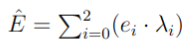
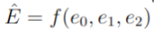

# ELMo: Deep Contextualized Word Representations

## 1 Introduction

Early architectures such as word2vec, GloVe for obtaining distributional representation of text made it easier to obtain a meaningful, low dimensional representation of a word for use in semantic tasks. These architectures provide a single representation for a word, which can be seen as an aggregated representation based on all possible contexts that word has appeared in the corpus used for training. But considering the complexity and ambiguity in language, we need more sophisticated representations of text that take in the context of a word in a given sentence. The representation of the same word would thus vary depending on what it means in its context. This is where some of the earlier works in developing contextual embeddings like ELMo, CoVe come in. Now, we'll advance on the quality of embeddings used by building an ELMo architecture, and testing its efficacy on a downstream task. ELMo looks at building a layered representation of a word through stacked Bi-LSTM layers, separately weighing in syntactic and semantic representations.

## 2 Implementation and Training

### 2.1 Architecture

Built an ELMo architecture from scratch using PyTorch. Instead of using a character convolution layer, an embedding layer is used for input word representation. The core implementation involves adding a stacked Bi-LSTM - each of which gives the embedding for a word in a sentence, and a trainable parameter for weighing the word embeddings obtained at each layer of the ELMo network. Only 2 layers of Bi-LSTM in the stack is used.

### 2.2 Model Pre-training

Learned the ELMo embeddings on the bidirectional language modeling objective by making use of the train split of the given dataset as an unlabeled corpus. This involves training on the word prediction task in forward and backward directions for training the Bi-LSTMs in the network.

### 2.3 Downstream Task

ELMo architecture has been trained on a 4-way classification task using the AG News Classification Dataset.

## 3 Hyperparameter tuning

For combining word representations across the different layers of the biLSTM in the downstream task, we make use of λs.

Where _Ê_ is the final contextual word embedding.

- **Trainable λs**: In this setting, the λs have been trained to give better representations.
- **Frozen λs**: In this setting, λs have been randomly initialized and frozen.
- **Learnable Function**: In this setting, A function has been learned to combine the word representations across layers to build the final contextual word embedding. If you set flag = False in the DownstreamModel while initializing then a function will be learned by training a seperate layer for the embeddings.

To run ELMO.py: `python3 ELMO.py`
This will save three files word2idx.pkl, forward1.pt and backward1.pt

To run classifier.pt: `python3 classifier.py`
ELMO.py should be executed before classifier.py

There are 5 models in total: forwardLM model, backwardLM model (which together constitutes biLSTM model), classifier model for each hyperparameter setting.
